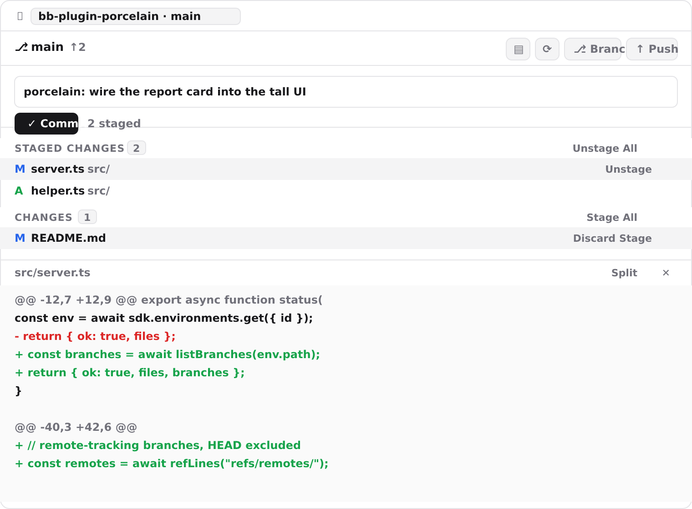
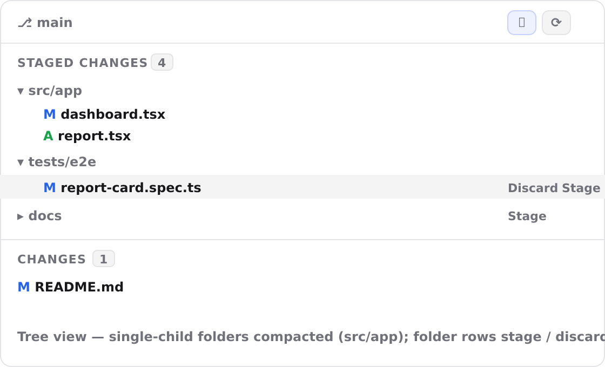

# Porcelain — Docs

**Porcelain** is the VS Code-style Source Control surface for a BB thread's
environment. It exposes the same review-and-commit workflow you know from the
SCM view, driven by `git status --porcelain` output — no shell, no leaving BB.

The panel lives in the thread's right rail: open **`+` → Changes**, or click
the compact branch-glyph button in the thread header.

## The Changes panel

1. **Repository picker** — when the environment root is a git repo it's used
   directly. Otherwise the panel scans up to three levels down for nested
   repos (a "projects folder" layout) and lets you choose which one to manage.
   The choice sticks per thread; a lone nested repo is selected automatically.
2. **Branch + ahead/behind** — current branch with `↑`/`↓` counts relative to
   its upstream.
3. **Toolbar** — the list / tree toggle, a refresh, **Branch** (switch or
   create), and **Push** (`git push`, adding `--set-upstream` when the branch
   has none).
4. **Commit box** — type a message and **Commit** (the index) or use
   **Commit All** (stages everything first). `⌘`/`Ctrl+Enter` commits.
5. **Staged Changes** — files already in the index, each with a status letter
   (`M`/`A`/`D`/`R`/`C`/`T`/`U`/`!`) and an **Unstage** action, plus
   **Unstage All** on the group.
6. **Changes** — unstaged modifications with **Stage** / **Discard** per file,
   plus **Stage All** on the group.
7. **Diff** — click any file to open the unified/split diff (BB's
   `experimental_Diff` viewer, with syntax highlighting and the live code
   theme).

The panel stays live: it refetches on the `porcelain:<threadId>` realtime
signal (emitted after every mutation and around agent turns) and on window
focus.

## List vs. tree view

The toolbar toggle switches between a flat list of file paths and a
collapsible folder tree:

- **Single-child chains are compacted** — `src/app/…` collapses to a single
  `src/app` row instead of one row per directory.
- **Folder rows stage / unstage / discard everything beneath them.**
- Collapsed folders show their nested change count implicitly; hover reveals
  per-file **Stage** / **Discard** actions.
- The preference persists across threads and reloads.

## Workflow

1. Make changes in the environment's working tree.
2. Open **Changes** and stage files individually, by folder (tree view), or
   with **Stage All**.
3. Review each file's diff by clicking it.
4. Enter a commit message and hit `⌘`/`Ctrl+Enter`.
5. **Push** to share the commit (the plugin sets `--set-upstream` on first
   push).
6. Use **Branch** to switch to any local or remote-only branch, or create a
   new branch from `HEAD`.
